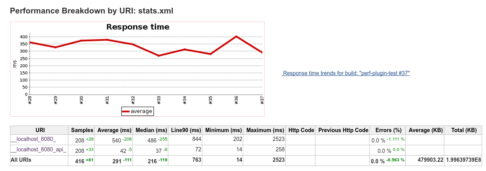

# Performance Plugin for Jenkins CI

Links:
 - [Documentation](http://jenkinsci.github.io/performance-plugin/)
   - [Running Tests](http://jenkinsci.github.io/performance-plugin/RunTests.html)
   - [Performance Trend Reports](http://jenkinsci.github.io/performance-plugin/Reporting.html)
 - [Jenkins Plugins Entry](https://wiki.jenkins-ci.org/display/JENKINS/Performance+Plugin)
 - [Changelog](http://jenkinsci.github.io/performance-plugin/Changelog.html)
 
Example Report:
 
