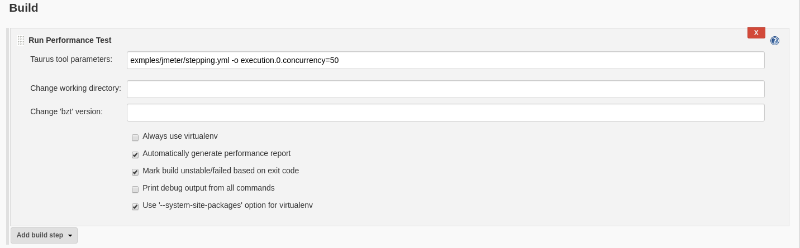

<small>[<< Back to main page](./)</small>
# Running Performance Tests

## Features
Performance Plugin for Jenkins uses [Taurus Tool](http://gettaurus.org/?utm_source=jenkins&utm_medium=link&utm_campaign=run_doc_main) to execute load tests. Main benefit of Taurus is that it provides abstraction layer over popular Open Source tools, including: [Apache JMeter](http://gettaurus.org/docs/JMeter/?utm_source=jenkins&utm_medium=link&utm_campaign=run_doc_jmeter), [Gatling Tool](http://gettaurus.org/docs/Gatling.md?utm_source=jenkins&utm_medium=link&utm_campaign=run_doc_gatling), [Grinder](http://gettaurus.org/docs/Grinder.md?utm_source=jenkins&utm_medium=link&utm_campaign=run_doc_grinder), [Locust.io](http://gettaurus.org/docs/Locust.md?utm_source=jenkins&utm_medium=link&utm_campaign=run_doc_locust) and even [Selenium](http://gettaurus.org/docs/Selenium/?utm_source=jenkins&utm_medium=link&utm_campaign=run_doc_selenium). You can run any of these load injectors from Jenkins build step with minimal prerequisites.

_Prerequisites for Jenkins server: have Python 2.7+ installed together with one of [virtualenv](https://pypi.python.org/pypi/virtualenv) or [bzt](https://pypi.python.org/pypi/bzt) PyPi packages installed._

Internally, build step will run Taurus tool, doing some extra work around it:

- it will search for global `bzt` available, if none found it will try to use `virtualenv` to install one locally into workspace
- it will run `bzt` with provided configs and options
- it will set job status based on `bzt` exit code, making it unstable or failed 
- it will automatically generate [performance trend report](Reporting.md) after `bzt` finishes

Build step tries to minimally interfere with Taurus tool to let you use its full capabilities (Taurus is pretty feature-rich thing for running tests).

Test runner step works fine with Jenkins slaves, as well as with Pipeline syntax (see section below.)


## Jenkins GUI Configuration
If you are using GUI-based job configs for Jenkins, choose "Run Performance Test" step from "Add build step" menu:


In the field that appears, you can simply specify path to your JMeter test plan file. This is Taurus capability due to high popularity of JMeter:


If you want to use extended capabilities of Taurus, you can specify its config files and options in 'Taurus Tool parameters' field. Generally, value of that field is what will go into command line parameters of `bzt` program.



Clicking on "Advanced..." will open several options that can alter build step behavior:

- _Change working directory_ - set working directory in which test will be run, by default will be used build workspace
- _Change 'bzt' version_ - set `bzt` version that will be installed inside a `virtualenv`, by default will be installed the latest version. If version is URL or path to file then it will be installed 
- _Always use virtualenv_ - enable this flag if you want to install `bzt` into `virtualenv`
- _Automatically generate performance report_ - enabled by default, builds [performance trend report](Reporting.md) from Taurus execution results, you can turn it off if you don't need report
- _Mark build unstable/failed based on exit code_ - enabled by default, will mark build step failed if Taurus exit code is 1, and will mark it unstable if it's another non-zero exit code
- _Print debug output from all commands_ - enable this flag if you are experiencing `bzt` installation issues and want to get more debugging information into console log
- _Use '--system-site-packages' option for `virtualenv`_ - enabled by default, it speeds up automatic installation of `bzt` into workspace, advanced users might want to turn it off

## Using from Pipeline Scripts

Here's example pipeline script to use build step with `bzt` command that maps to Taurus Tool invocation.

```groovy
node {
    stage("clean") {
        cleanWs()   // requires workspace cleanup plugin to be installed
    }
    
    stage('get config file') {
            sh "wget https://raw.githubusercontent.com/Blazemeter/taurus/master/examples/jmeter/stepping.yml"
    }
    
    stage("run test") {
        bzt "stepping.yml"
    }
}
```

## Other Ways to Run Test in Jenkins (deprecated)

### Using jmeter in a 'MAVEN' project
Follow the instructions in this [article](http://www.theserverlabs.com/blog/?p=280&cpage=1)

### Using jmeter in an 'ANT' project
Although there are different ways to run jmeter tests, here is explained a method to run them using ant.

Once you have your build.xml ready to run jmeter, you can add your project to Jenkins as a Freestyle-project which uses ant, and configure it following the instructions above.

Finally run your project setting the property jmeter-home to the appropriate folder in your computer: `ant "-Djmeter-home=C:\jmeter" -f build.xml`

```xml
<project default="all">
  <!-- ant-jmeter.jar comes with jmeter, be sure this is the release you have -->
  <path id="ant.jmeter.classpath">
    <pathelement
       location="${jmeter-home}/extras/ant-jmeter-1.1.1.jar" />
  </path>
  <taskdef
    name="jmeter"
    classname="org.programmerplanet.ant.taskdefs.jmeter.JMeterTask"
    classpathref="ant.jmeter.classpath" />
  <target name="clean">
    <delete dir="results"/>
    <delete file="jmeter.log"/>
    <mkdir dir="results/jtl"/>
    <mkdir dir="results/html"/>
  </target>
  <target name="test" depends="clean">
    <jmeter
       jmeterhome="${jmeter-home}"
       resultlogdir="results/jtl">
      <testplans dir="test/jmeter" includes="*.jmx"/>
      <property name="jmeter.save.saveservice.output_format" value="xml"/>
    </jmeter>
  </target>
  <!-- This is not needed for the plugin, but it produces a nice html report
       which can be saved usin jenkins's archive artifact feature -->
  <target name="report" depends="test">
    <xslt
       basedir="results/jtl"
       destdir="results/html"
       includes="*.jtl"
       style="${jmeter-home}/extras/jmeter-results-detail-report_21.xsl"/>
  </target>
  <target name="all" depends="test, report"/>
</project>
```